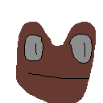

# Fracky



---


# Requirments

| C++|
|----------|
| C++17 or higher. |


# Getting started
### How to build
#### Building with premake
---
To build with premake you just need to add ``` include "{path to fracky}/premake5.lua" ``` into your main repo and link fracky to your project.

#### Building with CMake
---
To build with CMake just add ``` add_subdirectory({path to fracky}/CMakelists.txt) ``` to your main CMakelists and

## Writing your first script

To write to a file we have to make a vector of std::any any make a fracky serialization class

```
#include <fracky.h>
#include <vector>
#include <any>

int main()
{
    fracky::Serialization serialization;
    
    std::vector<std::any> file;
    
    file.reserve(5);
    
    file.emplace_back(fracky::Group("scene"));
    file.emplace_back(fracky::Group("player"));
    file.emplace_back(fracky::Line("gold","2000","[u]"));
    file.emplace_back(fracky::GroupEnd());
    file.emplace_back(fracky::GroupEnd());
    
    serialization.Write(file,"Scene.scn");
}
```

A better explanation and other features will be explained at the [Wiki](https://github.com/lanfeyns2/fracky/wiki). Happy coding :D
